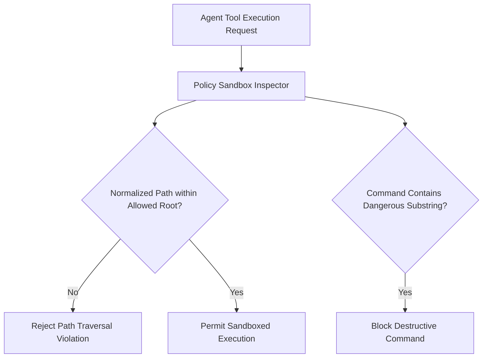

# genpark-tool-execution-sandbox-policy-enforcer-skill

Agent Skill implementing **Filesystem and Command Sandboxing Policy Enforcement** in 100% Python standard library.

## Architectural Flow

```mermaid
flowchart TD
    ToolCall["Agent Tool Execution Request"] --> Inspector["Policy Sandbox Inspector"]
    Inspector --> PathCheck{"Normalized Path within Allowed Root?"}
    Inspector --> CmdCheck{"Command Contains Dangerous Substring?"}
    PathCheck -->|No| Reject["Reject Path Traversal Violation"]
    CmdCheck -->|Yes| Block["Block Destructive Command"]
    PathCheck -->|Yes| Safe["Permit Sandboxed Execution"]
```
